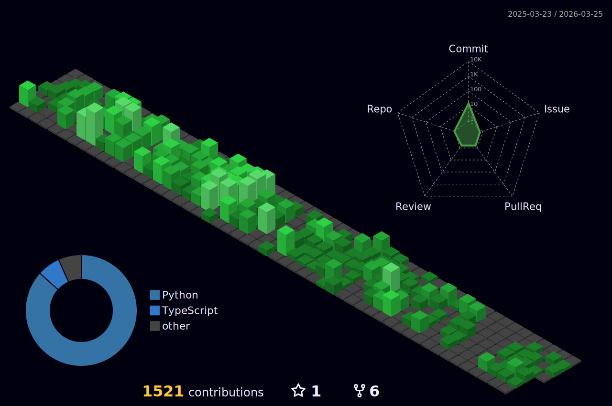

### Hello 

- 👋 Hello, welcome to my space!!
- 🖥️ Front-End Developer Pleno at [Framework Digital](https://www.frameworkdigital.com.br/)
- 📚Bachelor's in Computer Information Systems at the [Federal University of Viçosa](https://www.ufv.br/)!

 
  
  
   
 

  

 |  |  |  
 | ----------- | ----------- |

 
  

      
     
  

<!--
**herculesoliverr/herculesoliverr** is a ✨ _special_ ✨ repository because its `README.md` (this file) appears on your GitHub profile.

Here are some ideas to get you started:

- 🔭 I’m currently working on ...
- 🌱 I’m currently learning ...
- 👯 I’m looking to collaborate on ...
- 🤔 I’m looking for help with ...
- 💬 Ask me about ...
- 📫 How to reach me: ...
- 😄 Pronouns: ...
- ⚡ Fun fact: ...
-->
